# Planet Nutrition

## Project title:

### Planet Nutrition

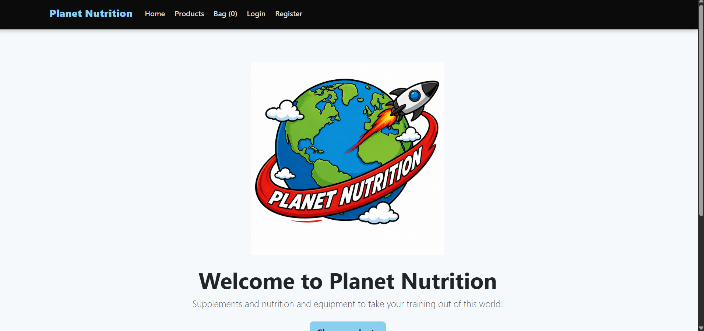

## Introduction:

Planet Nutrition is a sports equipment and supplements e-commerce website, that is targeted at users who are late teenagers onwards who have an interest in sporting goods. The website aims to be a one stop shop for all sporting needs, providing a clean and hassle free ordering system designed with simplicity in mind.

## Live Website and Github

[Planet Nutrition](https://nutrition-planet-e0408406543d.herokuapp.com/)
[Github](https://github.com/llpw-build/nutrition-planet)

## Project goals

### Site Owner Goals

- Have an easy to user e-commerce website that customers can easily use to purchase sporting goods and supplements.
- Allow customers to search, browse and filter the products on the website.
- Utiilise Stripe for secure payments.
- Ecourage footfall and user to then create accounts and purchase.
- Allow staff to be able to manage the products on the website.

### User Goals

- Easily purhcase sporting goods and supplements.
- Easily look through the products on the store.
- View their order and previous orders.
- Leave reviews on the products.
- Add and delete items from their bag.
- Create an account.

## User journey

1. User visits the website
2. Browses the products on offer
3. Selects the product and quantity
4. Adds it to the bag
5. Can then click into the bag
6. Can then go to checkout
7. Enters delivery and payment information.
8. Stripe processes all of the information.
9. Confirmation or rejection.
10. Order is saved to the user profile.

## Target Customer

The website aims to target users who are late teenagers onwards who have an interest in sporting goods and are able to make purhcases online.

## User Stories

- As a user, I want to be able to see all available products so I can easily choose which products I want.
- As a user, I want to be able to easily navigate around the website so that I have an easy user experience.
- As a user, I want to be able to see my bag total so that I know how many products I am purchasing.
- As a user, I want to be able to create an account so that I am able to save my information for future purchases.
- As a user, I want to be able to see whether my order was successful or not so that I can try again if it has failed.
- As a user, I want to be able to pay with Stripe so that I can safely complete my purhcase.
- As a user, I want an order number so that I can easily find my order.
- As a user, I want to be able to add numerous products to my bag so that I can order numerous items.
- As a user, I want to be able to update my products in my bag so that I can change the amount when needed before checkout.
- As a user, I want to be able to delete products from my bag for when I change my mind so that I can purchase the right amount.
- As a user, I want to be able to leave a review so that I can share my opinion with others.
- As a user, I want to be able to filter products so I can find the ones I want easily.
- As a staff user, I want to be able to add products so that we can sell more.
- As a staff user, I want to be able to edit products so that we can change prices.
- As a staff user, I want to be able to delete products so we can remove discontinued items.
- As a staff user, I want normal users to not be able to access staff sections so that we are not compromised.

## Features:

### Product Catalogue

The product catalogue provides the user with a clean and simple view utilising boot strap to design the ux with added CSS styling. Every product card has an image and useful information that the users can instantly see.

### Search 

A simple search capability was created to help the users find the products they require more easily. This was created also using bootstrap and styled to match the rest of the chosen colour pallete.

### Category filtering and sorting

Added category and sorting capabilites to the product catalogue to improve user experience.

### Product Details pages

Every product has a product detail page, which provides more indepth information about the product and also the ability to choose an amount and add the product to the users bag ready for checkout.

### Authentication/register/login

Authentication added throughout the project, users must be logged in to carry out certain actions such as leaving reviews, similarly users must also be marked as staff to carry out certain actions such as accessing the admin aspect of the project. Users are also able to register and create an account which can store their information and orders.

### User Profiles

The User Profile allows the user to store their information once they have created an account. They can also see their orders and the status of such order such as "paid" if the transaction has been successful.

### Shopping Bag

The shopping bag allows the user to store items and their quantity ready for purchase. The template then allows the user to either continue to checkout, update their product quantity or remove the product altogether.

### Checkout/ Stripe Payments

The checkout page allows the user to enter their information for the order and then also utilises stripe for any transactions that are carried out. A successful order provides the user with a success page, while a failed order will prompt the user as to what has gone wrong.

### Reviews

Basic review capability has been added to the website in order for users to be able to give their opinion on products. The user must be logged in and is then able to select a rating and leave a comment.

### Admin CRUD

Admin CRUD has been added, including being able to create brands, products, categories and edit things such as orders.

### UX/Design

For my project, I have chosen one of my favorite colourways which is baby blue and black. As these are stark contrasts I have also used white to offset the harshness that otherwise would have been off putting for the user. These are used throughout the website to create a recognisable brand when users are using the site.

### Bootstrap Responsive Layout

Bootstrap has been been used through the project in order to help design the site as "mobile first" and allow easy customisation throughout. I have utlisied Boostraps classes where possible to create a responsive grid system for the product cards, but allowing them to take up more space/ less space depending on the screen size.

### Navbar

A traditional Navbar has been added to the project, with links to seperate URLs and a logo that when clicked, redirects the user to home. Due to authentication the user will see different links whether they are logged in or out. The Navbar is also responsive and on smaller screens become a hamburger style menu.

### Homepage

The homepage has the company's logo to grab the user's attention, a short welcome message and slogan followed by a convenient button that will take the user to the product catalogue. If the user moves further down the page, they will see the short About Us section providing a brief overview of Planet Nutrition.

### Product Cards

Within the Product Catalogue, I used bootstrap to create product cards for a clean view of a selection of products that is responsive depending on what screen size the website is being viewed on. These cards are created using infromation from the Model; the information is name, brand, price, stock availability etc. Clicking on the product card takes the user to the Product Detail page.

### Mobile and tablet responsiveness

Depending on whether the user is viewing the project on either a mobile or tablet, the website adjusts its contents to be able to still be viewied in an appealing manner with a clean user interface. This ties back into the Bootstrap responsive classes that are mentioned above and are used throughout the site for this reason.

## Wireframes

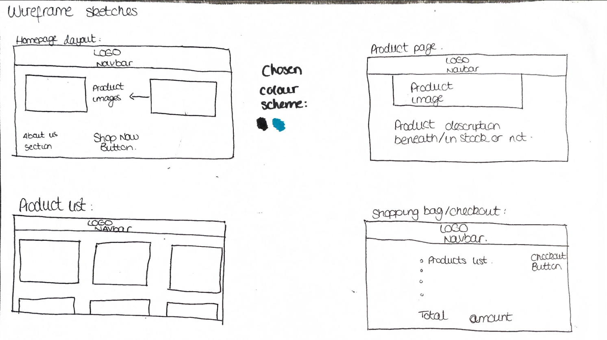

## Future Features

If I had not run into as many problems as I did, due to the steep learning curve of implementing Stripe, Cloudinary, Webhook code and so on, I feel I could have achieved much more with this product. Some of the features I would have liked to have included are:
- Blog section
- Fitness plan section
- Further styling to the Footer and Navbar
- A dedicated reward points section based on order amount and how many orders
- A wishlist allowing logged-in users to save products for later.

## Database Design

### Database Schema / ERD

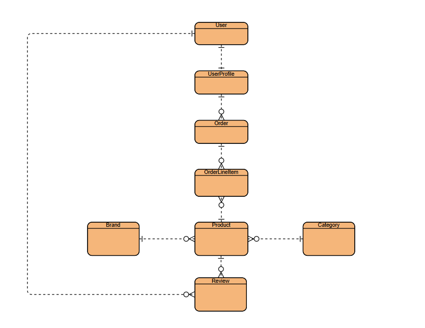

### Models

#### Category

My Category Model has a one-to-many relationship with Products, meaning one Category can contain many Products, while each Product belongs to one Category. The Category stores a name and friendly name, which are then utilised throughout the Product catalogue to organise and filter products.

#### Brand

My Brand Model again has a one-to-many relationship with Products, meaning that one Brand can contain many Products, while each Product belongs to one Brand. The Brand stores a logo, slug, brand name, description and website which can then be utilised throughout the website, including alongside the relevant Products.

#### Product

My Product Model has a many-to-one relationship with Brand and Category, meaning many Products can belong to one Brand or Category. Product also has a one-to-many relationship with OrderLineItem, as one Product can appear in many different OrderLineItems. The Product Model stores key information such as the name, materials, size or quantity, stock amount, price, description, image and whether the product is active.

#### Review

My Review Model has a many-to-one relationship with Products, as one Product can have many Reviews. It also has a many-to-one relationship with Users, as one User can create multiple Reviews. When saved this is then displayed to the Product Detail page.

#### UserProfile

My UserProfile has a one to one relationship with User, and I have set up User so that when a User registers for an account, it also creates a UserProfile for them. The UserProfile takes numerous bits of information, such as address, phone number etc.
#### Order

My Order Model has a many to one relationship with my UserProfile, meaning that one UserProfile can have many Orders associated with it. The Order stores the customer's delivery information, email, order total, payment status and Stripe PaymentIntent ID this is a key relationship that at first I struggled with, but now understand this allows the order to be associated with the right Stripe PaymentIntent ID.

#### OrderLineItem

My OrderLineItem Model has a many to one relationshiop with Product and also a many to one relationship with my Order Model. This is a key relationship fro my project, as we use the OrderLineItem to represent the individual Products and their quantities within an Order. Each OrderLineItem calculates its own total by multiplying the Product price by its quantity. The Order can then calculate its overall total using all of the OrderLineItems associated with it in order to avoid any errors within the Order total.

### Model Relationships

As mentioned above, my project has many Model Relationships which I will now outline below:
- User and Userprofile have one to one relationship. Every User has only one Profile.
- UserProfile and Order have a many to one relationship. One UserProfile may have many Orders.
- Brand and Product have a many to one relationship. One Brand may had many Products.
- Category and Product have a many to one relationship. One Category may have many Products.
- Product and Review have a one to many relationship. One Product may have many Reviews.
- User and Review have a one to many relationship. One User may have many Reviews.
- Order and OrderLineItem have a one to many relationship. One Order may have many OrderLineItems.
- Product and OrderlineItem have a one many relationship. One Product may belong to many OrderLineItems.

### Technologies used

HTML
CSS
Django
Python 
Javascript
Bootstrap
SQLite
PostgreSQL 
Stripe
Github
Cloudinary
Heroku

## Testing

### Manual Testing

I have carried out "smoke tests" numerous times, before deployment, during deployment and also after deployment while polishing my project. Numerous issues were found and resolved as I will list in the section beneath. I have also created a Feature Testing table to demonstrate these tests.

### Automated Testing

On django, you will see that I have added many tests to ensure the full django process is running while using a test environment and test database. Numerous times these tests failed, often due to wrong keys in settings. These tests range from Products (adding a product etc), Users (creating and logging in an a user), Checkout (being able to place an order successfully and testing behaviour based on whether the test succeeds or fails) and so on. A final automated test run was completed before submission. All 25 tests passed successfully in 32.881s. Django's system check also completed without identifying any issues.

### Deployment Testing

While deploying my project to Heroku, I ran into numerous issues, mainly due to images not loading as I had not yet utilised Cloudinary, getting frequent server errors due to incorrect secret key and no Heroku PostgreSQL database migrations applied (no data). All of these have since been resolved. 

### Feature Testing

| Feature | Test | Expected Result | Actual Result | Pass/Fail |
| --- | --- | --- | --- | --- |
| Navbar link | Select a Navbar link | Correct page displayed | Correct page displayed | Pass |
| "Shop Products" button | Select "Shop Products" | Product catalogue displayed | Product catalogue displayed | Pass |
| Registration | Register a new account | Account and UserProfile created and user logged in | Account and UserProfile created and user logged in | Pass |
| Register restriction | Visit register page while already logged in | Registration form cannot be accessed | User redirected with appropriate message | Pass |
| Login restriction | Visit login page while already logged in | Login form cannot be accessed | User redirected away from login page | Pass |
| Logout | Logout from an authenticated account | User successfully logged out | User successfully logged out | Pass |
| Product catalogue | Open product catalogue | Products and images displayed | Products and images displayed | Pass |
| Product detail page | Select a product | Correct product information displayed | Correct product information displayed | Pass |
| Search | Search for existing product | Matching product displayed | Matching product displayed | Pass |
| Invalid search | Search for non-existent product | No-results feedback displayed | No-results feedback displayed | Pass |
| Category filter | Select a category | Products from selected category displayed | Correct products displayed | Pass |
| Price sorting | Sort products low-high and high-low | Products displayed in correct order | Products displayed in correct order | Pass |
| Combined search/filter/sort | Combine catalogue options | Search, filtering and sorting work together | Correct combined results displayed | Pass |
| Add to bag | Add valid quantity | Correct product and quantity added | Correct product and quantity added | Pass |
| Add same product again | Add more of a product already in bag | Quantity updated correctly | Quantity updated correctly | Pass |
| Update bag | Change product quantity in bag | Quantity and totals recalculated | Quantity and totals recalculated | Pass |
| Multiple products | Add multiple different products | Products stored and total calculated | Products and total displayed correctly | Pass |
| Remove from bag | Remove a product | Product removed and total recalculated | Product removed and total recalculated | Pass |
| Stock validation | Add more than available stock | Request rejected | Request rejected | Pass |
| Existing quantity stock validation | Existing bag quantity plus new quantity exceeds stock | Request rejected | Request rejected | Pass |
| Out-of-stock product | Attempt to purchase product with no stock | Purchase prevented | Purchase prevented | Pass |
| Save details to profile | Save profile information | Details stored and displayed | Details stored and displayed correctly | Pass |
| Review | Logged-in user submits review | Review displayed on product page | Review displayed on product page | Pass |
| Review authentication | Attempt review functionality while logged out | Access prevented | Access prevented | Pass |
| Staff permissions | Normal user attempts staff-only functionality | Access denied | Access denied | Pass |
| Checkout | Proceed through checkout | Checkout form and Stripe payment interface displayed | Checkout loaded correctly | Pass |
| Successful Stripe payment | Complete successful Stripe test payment | Payment accepted and success feedback displayed | Payment accepted and success feedback displayed | Pass |
| Order creation | Complete successful checkout | Order stored correctly | Order stored correctly | Pass |
| Order history | View profile after purchase | New order displayed in order history | New order displayed correctly | Pass |
| Payment status | Complete successful payment | Order marked as paid | Order marked as paid | Pass |
| Stock after purchase | Complete successful purchase | Purchased stock decreases | Stock decreased correctly | Pass |
| Bag after purchase | Complete successful purchase | Bag cleared | Bag cleared correctly | Pass |
| Declined Stripe payment | Use declined Stripe test payment | Payment rejected and failure feedback displayed | Payment rejected and failure feedback displayed | Pass |
| Responsive layout | Test desktop, tablet and mobile sizes | Website remains usable and responsive | Layout displayed correctly at tested sizes | Pass |
| Mobile Navbar | Test navigation at mobile size | Responsive navigation available | Hamburger navigation displayed and worked | Pass |
| Static and media files | Browse deployed website | CSS, JavaScript and images load correctly | Assets loaded correctly | Pass |
| Internal navigation | Test main website links | Links lead to correct pages without errors | Links worked correctly | Pass |

## Bugs

### Bugs Fixed

The product fixture failed to load into the deployed PostgreSQL database because of a file encoding issue. I resolved this by recreating the fixture with Django's dumpdata command, committing the corrected file and then loading the data into the production database using loaddata.

Products could be added beyond available stock, so I resolved it by checking the current quantity against the products stock quantity before it could be added to the bag. I also accounted for the products already in the bag by using different quantity totals.

Cloudinary when installed caused my local tests in django to fail. This was due to using Cloudinary in the production environment but also needing to use local file storage for my local server tests. Resolved this by utilising a if statement within settings.

Heroku was missing all of my database tables when I deployed. I then remembered I had to migrate them to the Heroku PostgreSQL database and then that resolved the issue.

As mentioned above, I often run into a Stripe checkout error due to me having the secret key incorrect. This was resolved by checking the traceback and then resolving the key issue.

Again a similar issue I had was that my Cloudinary key was incorrect, so I was not able to upload images how I wanted to. This again was resolved by following the traceback and resolving the error in my key.

### Known Bugs (Not fixed)

Bug where card images are not uniform could not be resolved. Tried to override CSS and on the template but could not get the images to be uniform.

Following a declined Stripe payment, the checkout page may need to be refreshed before another payment attempt can be made. The declined payment is handled correctly and the user receives payment failure feedback, but refreshing the page is at the moment, required before retrying.

## Security

### Environment Variables

Configuration values are stored as environment variables utilising .env and gitignore rather than being hardcoded into my project.

### Secret Keys

The same can be said for secret keys, as they are similarly not committed to Django for security reasons.

### DEBUG

DEBUG as required is set to False and disabled to stop users seeing debugging information.

### Authentication and Authorisation

Django authentication has been utilised throughout the project. Certain functionality, such as leaving reviews and accessing a User Profile, requires the user to be authenticated.

### CSRF Protection

CSRF protection has been utilised on POST forms.

### Stripe Security

Stripe Keys stored securely using config vars and .env. Stripe and Webhook events are verified using Stripe Signature and Webhook secret before the event data can be utilised by django.

### Staff Permissions

Admin actions have been limited to staff only. Normal users cannot access these.

## Deployment

### Local Development

For local development I cloned my repository using VScode. I then also created a virutal environment in my terminal to be able to install packages. I created a requirements.txt to track what packages I used. I used .env to protect my important keys. I ran migrations to create the database tables and also ran the local Django development server.

### Heroku Deployment

For Heroku deployment, I had to link my GitHub repository to the Heroku app, then set my Config Vars and added a PostgreSQL database. I then ran migrations from the Heroku terminal and checked the deployed site after deployment to ensure everything was working correctly.

### Environment Variables / Config Vars

Environment variables were used throughout my project locally and I utilised a .env file and also a gitignore file to avoid any keys being revealed. Then for deployment, I utilised Heroku's config vars in order to protect any keys. These included ones for Django, Stripe and Cloudinary.

### PostgreSQL

SQlite was used for convenience during local development and during deployment I used PostgreSQL. Once this was added to Heroku, I ran migrations.

### Static Files / WhiteNoise

WhiteNoise was used for the deployed version of Planet Nutrition. Static files such as CSS and JavaScript are collected by Django and made available within the production environment. WhiteNoise allows Heroku to serve these static files without a separate static file server.

### Media Files / Cloudinary

Cloudinary was used to serve media files to my deployed site. During development for my tests, I also used an if statement to allow tests to pass whether using local storage or Cloudinary storage.

### Stripe Configuration

For my deployed site, I added the required keys to my config vars on Heroku to allow payments to continue to work. I also created a "Webhook endpoint" for the deployed version of my site. I also used Stripe test mode throughout development and deployment.

### Database Migrations

Whenever I made Django models or made changes to them, I always ran makemigrations and migrate locally. When deployed, as mentioned above, I used PostgreSQL and ran migrations on Heroku.

### Fixtures / Product Data

Product data was stored within a fixture so that it could be loaded into the database without me manually recreating every Product again. During deployment I found an issue loading the fixture due to its file. I solved this by recreating the fixture using Django's dumpdata command, committing the corrected fixture and then using loaddata.

## Version Control

### Git

Throughout my project I regularly used git as you will see from my work history as I added and committed changes. Commit messages describe the work that was carried out and this allowed me to track my project as I worked on it.

### GitHub

I hosted my repository on Github and pushed my commits to it throughout.

### Validation Testing

#### HTML Validation

The deployed website was tested using the W3C HTML Validator.

##### Homepage

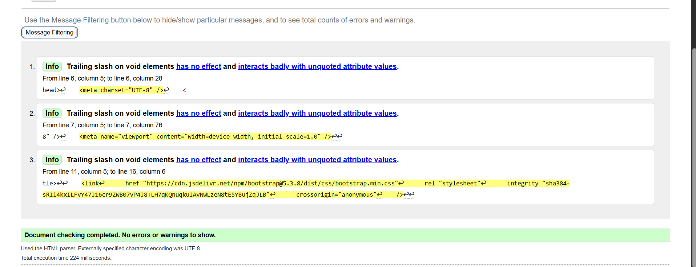

##### Products

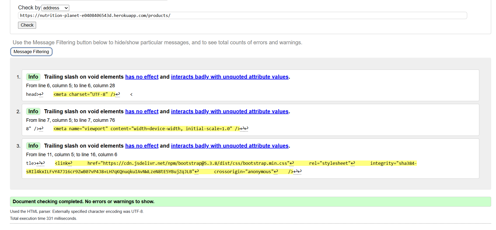

##### Shopping Bag

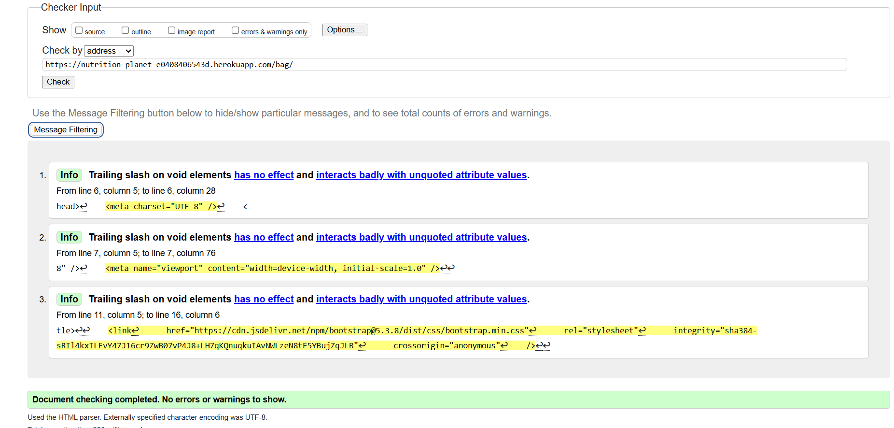

##### User Profile

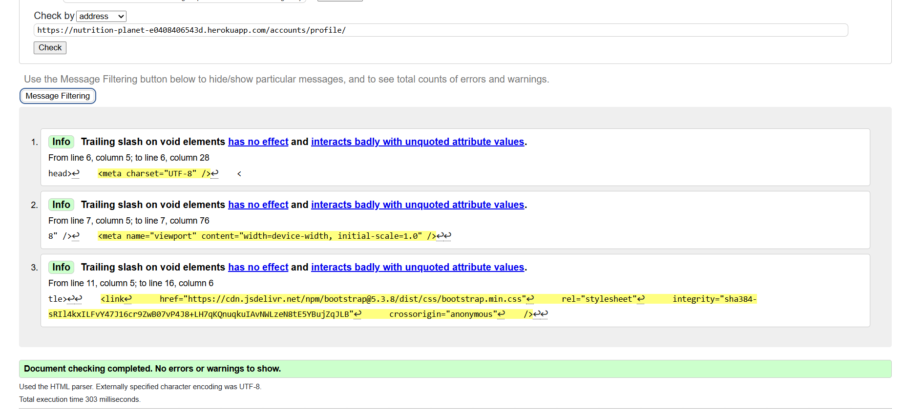

##### Login

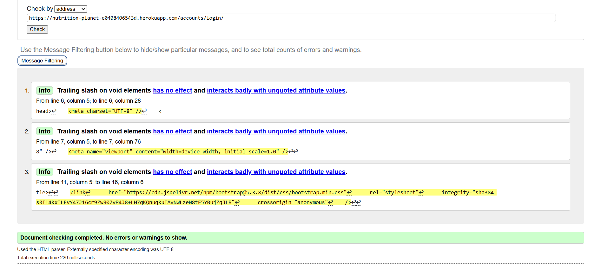

##### Register

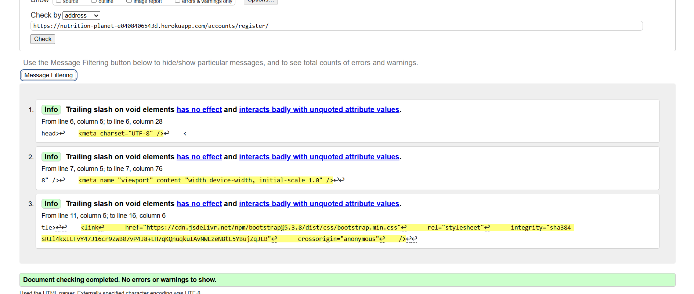

#### CSS Validation

The CSS used throughout Planet Nutrition was tested using the W3C CSS Validation.

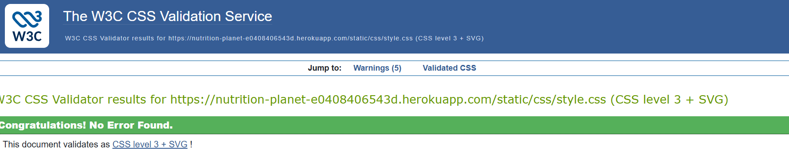

#### JavaScript Validation

The JavaScript used for the Stripe checkout functionality was checked using JSHint. The warnings shown relate to modern JavaScript features such as `const`, `async` functions and template literals, which require the appropriate ES6/ES8 configuration in JSHint.

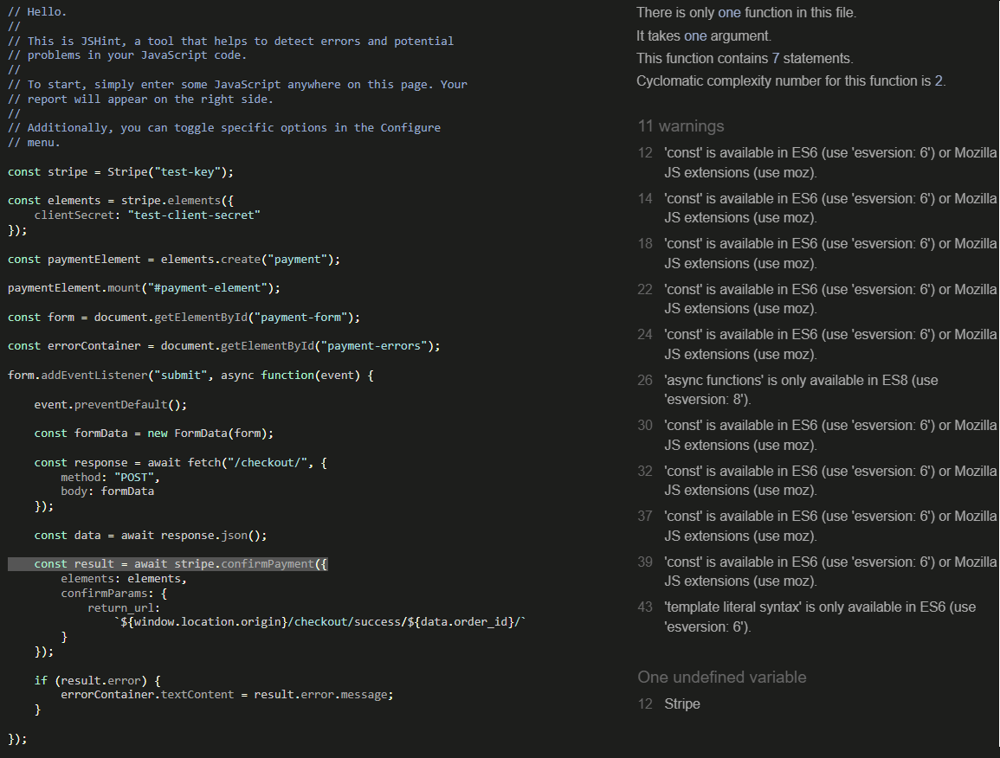

## Credits

### Code

The code for Planet Nutrition was written by myself while using the course material as my main go to point for any issues I came across. During development I always referred to official documentation and guides when learning how to implement any features or troublshoot any functionality issues I ran across. These were used as guides rather than as actual full solutions, with them being adapted for my own project.

### Documentation

- [Django Documentation](https://docs.djangoproject.com/) - Used as a reference for Django models, views, forms, authentication, testing and other Django functionality.
- [Stripe Documentation](https://docs.stripe.com/) - Used as a reference when implementing Stripe payments, PaymentIntents and Webhooks.
- [Bootstrap Documentation](https://getbootstrap.com/docs/) - Used when creating the responsive layout, Navbar, product cards, buttons and other UI elements.
- [Cloudinary Documentation](https://cloudinary.com/documentation) - Used when configuring Cloudinary for image and media storage.
- [Heroku Documentation](https://devcenter.heroku.com/) - Used as a reference when deploying the application to Heroku.

### Images

I created all of the images myself.

### Content

All of the written content and website name was written by myself.

### Libraries / Frameworks

- Django
- Bootstrap
- Stripe
- Cloudinary
- WhiteNoise
